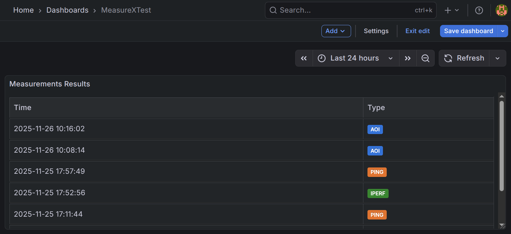
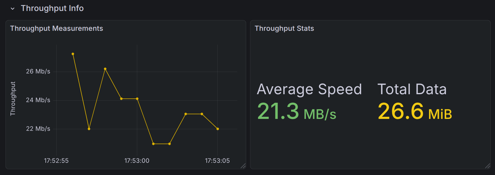
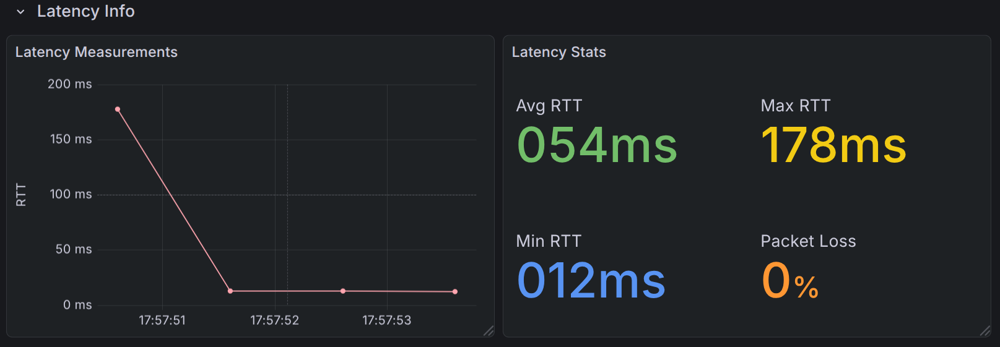
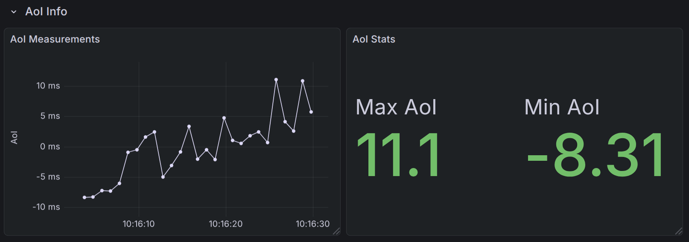

# Measure-X: Examples of Measurements

You can check that everything is working fine, by running some test meaurements on the Wi-Fi network. Actually, Masure-X can also be used to test such network, albeit with reduced functionality (for instance, energy measurments are not possible since the energy measurment chip is provided by the 5G HAT).

After having activated the pyhton virtual environment, start the controller:
````
python3 measure-x/coordinator.py
````
The controller will print some information like:
     * Running on http://10.147.13.91:8085

Start the probes in `dbg` mode. For instance, connect to probe1 via ssh and start it (or you can use the ansible playbook to start all the probes):
```
source measurex_venv/bin/activate
python3 measureX/probesFirmware/firmware.py -dbg
````
Let's suppose that probe1 and probe2 have been started. 
The following examples are based on the [Talend API tester extension](https://chromewebstore.google.com/detail/talend-api-tester-free-ed/aejoelaoggembcahagimdiliamlcdmfm) for Chrome.

To start a new ping measurement, you have to send a JSON document that describes the measurement itself. You have to use POST to the 
`http://10.147.13.91:8085/measurements` endpoint. the IP address is the on of the coordinator. Please note that it is http and not https.

This is a simple JSON that asks for a ping measurement from probe12 to probe99:
```
{"type": "ping",
 "source_probe": "probe12",
 "dest_probe": "probe99",
 "description": "A simple test"}
 ````

If everything is fine, you'll receive a 200 OK response. In the response the id assigned to the measurement will be shown. The id is needed to have information about the status of the measurment and to retrieve the results. This is an example of response: 
>{
> "_id": "68947804ff8039365b3df86e",
> "coexisting_application": null,
> "description": "A simple test",
> "dest_probe": "probe99",
> "dest_probe_ip": "131.114.58.101",
> "gps_dest_probe": null,
> "gps_source_probe": null,
> "parameters":{
> "packets_number": 4,
> "packets_size": 32
> },
> "results":[],
> "source_probe": "probe12",
> "source_probe_ip": "10.46.100.25",
> "start_time": 1754560517.1813881,
> "state": "started",
> "stop_time": null,
> "type": "ping"
>}

This is a screenshot of the browser: 


Using the measurement id, it is possible to retrieve the results. In particular, you have to send a GET request to the 
`http://10.147.13.91:8085/results/68947804ff8039365b3df86e`endpoint (the last part is the measurement id), as shown in the following example:


This is another example where throughput is measured using iperf: 
```
{"type": "iperf",
 "source_probe": "probe12",
 "dest_probe": "probe99",
 "description": "A simple throughput test"}
```


and this is the result:


The `full_result` field contains the detailed iperf3 output. 

This is another example, where energy is measured in the presence of some CBR traffic. This example does not work on Wi-Fi, but only with real 5G connectivity:
````
{
    "type": "energy",
    "source_probe": "probe12",
    "dest_probe": "probe99",
    "description": "A consumption test with coex application",
    "coexisting_application": {
        "description": "Some CBR traffic",
        "source_probe": "probe12",
        "dest_probe": "probe99",
        "packets_size": 1,
        "packets_rate": 1,
        "duration": "60",
        "delay_start": "0"
    }
}
````

After having started the energy measurement, it can be stopped by using a DELETE request using the measurement identifier provided back by the system.

## Traffic Tracks Distribution
The new release introduces a way to distribute a traffic track automatically to all the probes.
Place the `track_to_distribute.pcap` file in the `tracks_to_distribute` directory, then launch the following command from `yaml_ansible` directory:
```
ansible-playbook -i [your_inventory] track_distribution.yaml
```

## Grafana Dashboard

Measure-X includes a fully interactive Grafana dashboard designed to visualize measurement history and analyze network performance. The dashboard uses a **Master-Detail** architecture: a main interactive list controls the detail panels below, allowing for analysis of specific test runs.

### Accessing the Dashboard

By default, Grafana is available on port `3000` of the coordinator.
Point your browser to: `http://<coordinator_ip>:3000`

### 1\. Measurement Selection 



The top section of the dashboard features the **Measurements Results** list. This panel queries the MongoDB database based on the selected **Time Range** (top-right corner of Grafana).

  * **Time Filter:** Ensure the time range (e.g., "Last 24 hours", "Last 7 days") covers the timestamp of your measurements.
  * **The List:** Displays all measurements (Ping, Iperf, AoI) found in the period, showing the Timestamp and Type.
  * **Interaction:** Click on any row to select a specific measurement. This action updates the dashboard variable and triggers the detail panels below.

### 2\. Detail Analysis

The dashboard is **context-aware**. Depending on the type of measurement selected in the master list, different detail rows will populate with data.

#### Throughput Analysis (Iperf)

When an **Iperf** measurement is selected, the "Throughput Details" row becomes active:

  

  * **Time Series:** Visualizes the bandwidth stability over the entire duration of the test (second by second), derived from the iperf `intervals`. This helps in identifying temporary drops or network instability.
  * **Statistics:** Displays the Average Speed and Total Data transferred during the session.

#### Latency Analysis (Ping)

When a **Ping** measurement is selected, the "Latency Details" row displays:

  

  * **RTT Evolution:** A graph showing the Round Trip Time for every single ICMP packet. This allows for visual analysis of Jitter and latency spikes.
  * **Statistics:** Summarizes Average, Min, and Max RTT, along with the Packet Loss percentage.

#### Age of Information (AoI) Analysis

When an **AoI** measurement is selected, the dashboard provides a focused view on the freshness of information:

  

  * **AoI History:** A time-series graph showing the instantaneous AoI evolution for every packet received during the selected test. This allows you to see how the age of information fluctuates over time.
  * **AoI Statistics:** A dedicated panel highlighting the specific **Maximum** and **Minimum** AoI values reached during that specific measurement run.


